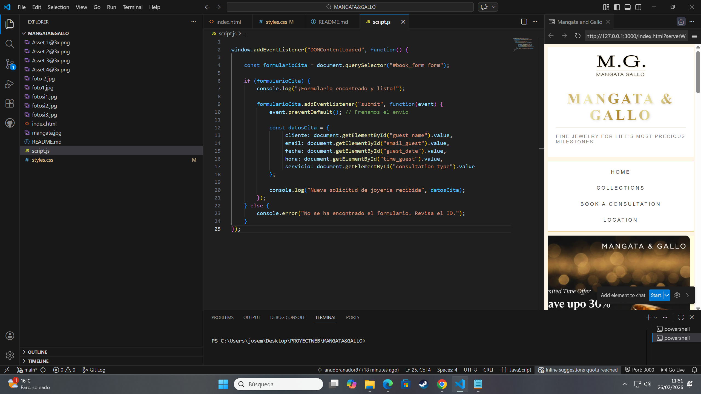

# 📓 THE 365-DAY DEV JOURNEY: Jose Aparicio ES-VERSION
> **"La lógica es mi superpoder, la sintaxis es solo la herramienta."**

## 🚀 MI "UPGRADE" DE CARRERA: DE HOSPITALITY A WEB DEVELOPER

Este diario no es solo una lista de temas estudiados; es el **registro de ingeniería** de mi transición profesional. Tras más de 8 años gestionando equipos y resolviendo crisis en el sector de la **Hostelería (UK y España)**, estoy aplicando esa misma resiliencia y capacidad de resolución al mundo del desarrollo de software.

### 🛠️ ¿QUÉ VAS A ENCONTRAR EN ESTE LOGBOOK?
Para un reclutador, la duda siempre es: *¿Realmente sabe resolver problemas?*. Aquí documento mi lucha diaria, mis errores de lógica y mis victorias técnicas para demostrar tres cosas:

* **Consistencia Inquebrantable:** Un registro diario de mi evolución, sin filtros.
* **Mentalidad de Debugging:** No solo muestro el código que funciona, sino cómo **"derribé el edificio"** para construir cimientos más sólidos cuando las cosas se pusieron difíciles.
* **Seniority en Actitud:** Mi experiencia previa no es un paréntesis; es el **motor** que acelera mi capacidad de aprendizaje y mi visión de producto orientada al usuario real.

# 🧭 Roadmap de Aprendizaje (Vista Mensual)

| Mes | Tema Principal | Proyectos y Retos | Habilidades Clave |
| :--- | :--- | :--- | :--- |
| **Enero** | ✅ **Fundamentos Web (freeCodeCamp)** | Web Campus & Crema Teatinos, Formularios de Registro | HTML5 Semántico, CSS3, Maquetación básica. |
| **Febrero** | 🔥 **Especialización CSS & JS (Meta)** | Mangata & Gallo, Juego de Cartas, App de Reservas (WIP), Sistema de Niveles | CSS in Depth, Lógica de Arrays, Funciones, Manipulación del DOM. |
| **Marzo** | 🏗️ **Próximamente** | *Por definir...* | *Por definir...* |

---

## 🗓️ [Día 20 de Febrero, 2026]
### 📝 Resumen del Día
Hoy he alcanzado mi primer **"clic" mental importante**. Mi enfoque no ha sido solo escribir líneas de código, sino dominar el arte del **debugging** y entender el flujo de control profundo en JavaScript y la jerarquía de selectores en CSS.

### 🛠️ Conceptos Técnicos Dominados:

* **💻 JavaScript: Lógica y Estructura**
    * **Gestión de Variables:** Perfeccioné el uso de `let` y la reasignación dinámica.
    * **Template Literals:** Implementé el uso de backticks (`` ` ``) para inyectar variables en strings de forma limpia.
    * **Operador de Módulo (%):** Clave para resolver la lógica de precios según productos pares/impares.
    * **Scope de Bloque:** Entendí por qué las variables declaradas con `let` viven y mueren dentro de las llaves `{}`.

* **🎨 CSS: Maquetación y Selectores**
    * **Box Model:** Análisis profundo de **padding**, **border** y **margin** para evitar el desbordamiento de contenedores.
    * **Interacción (UX):** Uso de pseudoclases `:hover` para feedback visual.
    * **Selectores de Relación:** `+` (Hermano adyacente) y `~` (Hermano general).

### 🧩 Resolución de Problemas (Debug Log)
* **Logro del momento:** He construido mi primer periódico digital desde cero. 
* **Correcciones:** He corregido errores de sintaxis en **text-transform** y he aprendido a diferenciar **font-weight** de **font-family**. 
* **Estado:** Mi estructura de **Flexbox** está empezando a tener sentido.

> **💡 Mi Nota Mental:** "La lógica es mi superpoder, la sintaxis es solo la herramienta."

---

## 🗓️ [Día 22 de Febrero, 2026]
### 🔨 Forjando el Formulario de Odin project
Hoy he terminado el proyecto del formulario de registro y, sinceramente, **el cambio de nivel se nota**. No solo he picado código, sino que he tomado decisiones de diseño y he usado herramientas profesionales.

### 🧠 Lo que he aprendido hoy:
* **📐 Grid y Alineación Real:** He dominado cómo dividir la pantalla en columnas (`2fr 3fr`) y cómo usar `grid-template-columns: 1fr 1fr` dentro del formulario para que todos los inputs queden perfectamente alineados en parejas sin que se muevan según el texto.
* **🖋️ Jerarquía Tipográfica:** He reservado la fuente **Norse** para el branding y el botón de acción, y he usado **Inter** para que los textos largos y los labels se lean sin esfuerzo.
* **🌑 Sombras con Intención:** He pasado de las sombras genéricas que no me gustaban a crear una sombra direccional (**Bottom Shadow**) usando el eje Y (`box-shadow: 0 8px 15px rgba(0,0,0,0.1)`). Ahora el formulario parece que flota, no que está sucio.
* **✨ Micro-interacciones:** He configurado un efecto `:hover` profesional que no solo cambia el color, sino que eleva el botón con `transform: translateY(-3px)`. Se siente **"vivo"**.

---

## 🗓️ [Día 23 de Febrero, 2026]
### 🚀 "Hoy he dejado de hacer una web 'que funciona' para hacer una web profesional"
Hoy ha sido un día de una **intensidad brutal**. He saltado del diseño visual a la lógica pura, enfrentándome a problemas que separan a los aficionados de los desarrolladores reales. 

### 📱 La Batalla por la Adaptabilidad (Responsive Design)
No me he conformado con que la web se vea bien en mi monitor. He luchado con las **Media Queries** para que la experiencia sea fluida en móviles y tablets:
* **El cambio de estrategia:** He tenido que refactorizar el contenedor principal. Lo que en escritorio era un Grid organizado, en pantallas pequeñas lo he transformado en un Flexbox con `flex-direction: column`.
* **Superando el Caos del CSS:** Mi mayor dificultad aquí ha sido la **Cascada de CSS**. Los estilos globales se daban de bofetadas con los de las Media Queries. He tenido que aprender a priorizar y organizar mis selectores para que la web no se **"rompiera"** al encoger la ventana.

### 🎨 Perfeccionando la Experiencia (UI & UX Avanzado)
He querido que el usuario sienta que está en una web de calidad premium:
* **🔍 Validación Inteligente:** He implementado la pseudoclase `:user-invalid`. Me volví loco al principio porque los bordes rojos salían nada más cargar la página, lo cual era súper agresivo. Ahora, el feedback solo aparece después de que el usuario interactúa. Es un detalle de **"pro"**.
* **⚡ Micro-interacciones:** He añadido efectos de `transition` y `transform` en los `input:focus`. Ahora los campos **"reaccionan"** cuando vas a escribir, dándole un toque táctil y moderno.
* **✍️ Tipografía de Élite:** He configurado las fuentes **'Norse'** e **'Inter'** ajustando el `letter-spacing`. He aprendido que el diseño está en los detalles invisibles.

### 🥊 JavaScript y la Lógica de Reservas (El gran reto)
> **"De la frustración al éxito: Cómo construí el motor de Campus & Crema"**

1.  **El Momento del "Borrón y Cuenta Nueva":** Empecé el día con un código que era una jungla. En lugar de seguir poniendo parches, tomé la decisión más difícil pero más inteligente: **empezar de cero**. He aprendido que, en programación, a veces hay que derribar el edificio para construir unos cimientos sólidos. He definido mi Array de `mesasOcupadas` con precisión, entendiendo que cada dato cuenta.
2.  **El Laberinto de la Sintaxis (Mis dificultades):**
    * **La guerra de los símbolos:** Al principio me volvía loco con el `=` y el `===`. Me frustraba ver que el **"semáforo"** no cambiaba de color. He descubierto que usar `(estaOcupada === true)` dentro de un bucle es como hacer una pregunta al aire sin anotar la respuesta. La solución fue entender que necesitaba una orden directa: `estaOcupada = true;`.
    * **El caos de los paréntesis y llaves:** Ha sido mi mayor reto. He tenido errores de **"gramática"** de código que me daban ganas de mandarlo todo a paseo. Paréntesis que abrían pero no cerraban, o ese `if` que se quedaba cojo por no tener su **"cajita"** de paréntesis.
    * **El punto y coma traicionero:** Hubo un momento en que puse un punto y coma justo después de un `for`, bloqueando todo el motor. Aprender a **"ver"** estos errores invisibles ha sido un entrenamiento visual increíble.

> **🧠 Reflexión Final (Error Lógico):** Hoy he visto que el desarrollo web es un equilibrio. De nada sirve un JS perfecto si la web se ve mal en un iPhone, y de nada sirve un CSS precioso si el botón de reserva no sabe distinguir una hora libre de una ocupada. El error lógico de hoy ha sido entender que el diseño y la lógica son un solo cuerpo.

---

## 🗓️ [Día 24 de Febrero, 2026]
### 🏋️ "Sesión de Entrenamiento: Algoritmos y Estructuras de Datos"

### 🚀 Logros del día (Basados en ejercicios)
* **💼 Resolución de Casos de Uso:** He realizado una serie de ejercicios prácticos simulando entornos reales (E-commerce, Sistemas de Login y Perfiles de Usuario).
* **⚙️ Construcción de Lógica Dinámica:** A través de retos, he aprendido a generar estructuras de HTML dinámico mediante funciones y **Template Literals**.
* **📂 Arquitectura de Información:** He practicado la anidación de datos, integrando **Arrays dentro de Objetos** para gestionar perfiles complejos.

### 🥊 La "pelea" con el código (Aprendizaje basado en errores)
Hoy la sesión de prácticas ha sido un **"combate" constante** contra la sintaxis y la lógica:
* **⚔️ Guerra de Símbolos:** Durante los ejercicios, me **"pelee"** con el uso de `()` vs `{}` vs `[]`. Tras varios intentos fallidos, he consolidado que las llaves son para objetos y los corchetes para listas.
* **↪️ El desafío del "Return":** En las prácticas de funciones, identifiqué el error común de intentar usar **return** fuera de su ámbito o confundirlo con **console.log**.
* **🧪 Mutación vs Asignación:** En el reto de gestión de inventario, sufrí las consecuencias de usar `=` en lugar de `.push()`, aprendiendo por las malas cómo un error de asignación puede destruir una base de datos de strings.


## 🗓️ [Día 25 de Febrero, 2026]

### 🚀 [Logros del Día](#)

* **`🔵 Motor de Estado Circular`**: Creación de un bucle lógico que incrementa del 1 al 10 y reinicia a `0` al llegar al nivel 11.

* **`🔵 Modo Legendario`**: Disparador visual (escala, bordes dorados y brillo) al alcanzar el nivel máximo.

### 🥊 [La "Pelea" con el Código (Depuración Real)](#)

* **↪️ El Conflicto del Else (Limpieza Prematura):**
    * **Fallo:** Al volver a 0, el efecto dorado desaparecía tan rápido que mataba la experiencia del usuario.
    * **Solución:** Reorganización del flujo `if/else` para priorizar la persistencia visual del hito alcanzado.

* **🧪 Pesadilla de Sintaxis:**
    * **Fallo:** Código muerto por un paréntesis extra `{(this...` y por usar puntos `.` dentro de `classList`.
    * **Solución:** Consolidación de sintaxis: `classList` no lleva punto y los bloques de código deben estar limpios de caracteres huérfanos.

    ### 🏆 [Prueba visuual del logro](#)
    
    
  
    
    ---

### 🏋️ "Sesión de Entrenamiento por la tarde : Diagnóstico y Gestión de Errores en JS (Meta - Coursera)"

### 🚀 Logros del día
* **`🔴 Formación Especializada`**: Avance en el curso de **Meta en Coursera**, profundizando en la resiliencia del código a través de la gestión de errores.
* **`🔴 Clasificación de Errores`**: Identificación y resolución de los 4 jinetes del apocalipsis en JS: **Reference**, **Type**, **Range** y **Syntax**.
* **`🔴 Estructuras de Control de Fallos`**: Implementación de bloques `try...catch` para crear aplicaciones profesionales que no se detienen ante fallos inesperados.
* **`🔴 Anatomía del Objeto Error`**: Uso de las propiedades `.name` y `.message` para extraer información crítica durante el debugging.

### 🥊 La "pelea" con el código (Tipos de errores detectados)

* **⚔️ El Error de Referencia (ReferenceError):** * **Fallo:** Llamar a una variable no declarada.
    * **Lección:** Sin `let` o `const`, JavaScript no encuentra el "personaje" en memoria.
* **⚔️ El Conflicto de Tipos (TypeError):** * **Fallo:** Usar métodos incompatibles (ej: `.toUpperCase()` en un número).
    * **Lección:** Cada tipo de dato tiene sus propias herramientas; no puedes batir un huevo con un destornillador.
* **⚔️ Fuera de Rango (RangeError):** * **Fallo:** Valores numéricos fuera de los límites legales (ej: `new Array(-1)`).
    * **Lección:** Forzar los límites lógicos de JS detiene el motor de ejecución.
* **⚔️ La Barrera de la Sintaxis (SyntaxError):** * **Fallo:** Olvidar una llave `}` o un paréntesis `)`.
    * **Lección:** Es un error de gramática que impide que el código siquiera arranque.

### 🧠 Reflexión de Ingeniería: El Error Lógico
Gracias a los materiales de **Meta**, hoy he interiorizado que los errores lógicos son los más críticos porque la consola no te avisa. La revisión constante y el pensamiento crítico son nuestra mejor defensa.

---


# 
# 📔 Diario de Bitácora - Jose María
## 📅 Fecha: 26 de febrero de 2026
## 🎯 Estado: Superación y Comprensión Profunda

---

### 📖 El Contexto: El Examen de Coursera
Hoy completé el examen oficial de **Coursera** sobre funciones en JavaScript. El sistema marcó un aprobado, pero para mí no era suficiente. El examen se centraba mucho en la teoría: el uso de `%c` para dar formato a la consola, el manejo de variables locales y el encadenamiento básico. 

A pesar de tener el certificado, sentía que la **"pesadilla de la sintaxis"** seguía ahí. No entendía del todo cómo los datos viajaban de una función a otra ni por qué usábamos ciertos símbolos. El examen era una prueba de memoria; yo quería una prueba de lógica.

---

### 🚀 La Decisión: Ir más allá de la teoría
Inconforme con solo "pasar el test", decidí bajar el código al suelo. Aparqué los ejercicios teóricos y me propuse construir un **Caso Real: Un Generador de Tickets de Supermercado**. 

Mi objetivo era entender tres cosas que el examen no me terminaba de aclarar:
1.  **El origen de los datos:** ¿De dónde salen las variables si no están definidas arriba? (Entendido: Parámetros como asientos reservados).
2.  **La comunicación:** ¿Cómo le pasa una función el resultado a la siguiente? (Entendido: El flujo del `return` al argumento).
3.  **La activación:** ¿Por qué no puedo usar el signo `+` para llamar a una función? (Entendido: El uso de los paréntesis `()` como el único interruptor real).

---

### 🛠️ El Logro Técnico: Arquitectura Modular
He diseñado un sistema de tres niveles que ahora entiendo a la perfección:
* **Procesador:** `formatearPrecio` (Transforma el número en dinero).
* **Interfaz:** `imprimirTicket` (Muestra el mensaje al humano).
* **Controlador:** `realizarCompra` (La jefa que coordina el flujo entre ambas).

---

### 🥊 Batalla de Debugging (Lo que realmente aprendí)
* **Error de concepto:** Intentar sumar funciones con `+`. Corregido al entender que la función se **invoca**.
* **Error de sintaxis:** Mezclar `${}` con paréntesis. Aprendí que los Template Literals son quirúrgicos: si no cierras bien la llave, el código muere.
* **El momento "Click":** Entender que `producto` y `precio` son nombres temporales que yo elijo para que el código sea legible para otros humanos.

---

### 📸 Estructura del Código Final

```javascript
function formatearPrecio(cantidad) {
    return `€${cantidad}`;
}

function imprimirTicket(producto, precioConSimbolo) {
    console.log(`Has comprado: ${producto} por un total de ${precioConSimbolo}`);
}

function realizarCompra(nombreArticulo, valorNumerico) {
    let resultado = formatearPrecio(valorNumerico);
    imprimirTicket(nombreArticulo, resultado);
}
```
// La llamada que lo inicia todo:
realizarCompra("Manzanas", 5);

---

## 💎Avances con el "Proyecto": Mangata & Gallo - Implementación de Formulario

**Objetivo:** Construcción y conexión del formulario de consulta para el catálogo de joyería.

* **Integración de JavaScript:** He vinculado el formulario a un archivo `script.js` mediante la etiqueta `<script>` al final del body.
 Mi meta es aplicar la lógica de funciones que he practicado hoy para gestionar el envío.
* **Gestión de Activos (Assets):** Aplicación de CSS al fondo del formulario para mantener la estética de marca (lujo y precisión) sin distorsionar las imágenes de fondo.

### ⚠️ Deuda Técnica (Estado Actual)
* **Lógica Funcional:** El script está vinculado, pero estoy refinando la captura de datos.
* **El "Combate":** Estoy depurando un error lógico donde los datos no se capturan correctamente en el evento `submit`. 
Voy a aplicar la estructura de "Función Maestra" que aprendí hoy para organizar mejor este proceso.
* **Meta:** Lograr un sistema de validación total para la sección de contacto.




## 🗓️ [Día 27 de Febrero, 2026]
### 🎯 Estado: Comprensión de JavaScript aplicado a componentes e interfaces

---

### 🌓 El Logro: Modo Oscuro Nativo
Hoy he finalizado la implementación de un **Modo Oscuro** funcional en mi portafolio web. Tras varias sesiones de trabajo, he logrado que la interfaz se adapte a las preferencias del usuario, mejorando la accesibilidad y la salud visual.

#### 🛠️ ¿Cómo lo he hecho?

1. **Lógica con JavaScript**: Utilicé manipulación del DOM para crear un *Event Listener* que detecta el clic en el botón de cambio de tema, activando un `classList.toggle('dark-mode')` en el cuerpo del documento.
2. **Arquitectura CSS (Design Tokens)**: En lugar de cambiar colores de forma individual, diseñé un sistema de **Variables CSS (`Custom Properties`)**. Esto permite que el cambio de tema sea centralizado y escalable.


#### ⚔️ Dificultades y Aprendizaje
***Orden vs. Caos**: Me enfrenté a una selva de estilos duplicados y colores fijos (*hardcoded*) que bloqueaban la herencia. Limpiar el código fue vital para que las variables funcionaran.
***Sintaxis Estricta**: Descubrí que el CSS es implacable; una llave `}` mal cerrada invalidaba secciones enteras. Aprendí que la jerarquía y el orden son la base de un desarrollo profesional.

#### 🚀 Resultado
He pasado de un archivo desordenado a una arquitectura limpia que impresiona por su eficiencia.


### 📓 Bitácora de Aprendizaje - JavaScript POO
**Sesión:** Profundización en POO y Herencia (Curso de Meta)

#### 📝 Resumen del Progreso (Metodología STAR)

***S (Situación):** 📍 Me encontraba avanzando en el curso de **Meta**, enfrentándome a conceptos de POO que me resultaban muy abstractos y difíciles de visualizar en la práctica.
***T (Tarea):** 🎯 El objetivo era comprender y aplicar la jerarquía de clases y la herencia en JavaScript, pasando de la teoría a la construcción de un modelo funcional de `Persona` y `Empleado`.
***A (Acción):** 🛠️ Diseñé y depuré una estructura de clases donde:
    * Implementé `extends` para establecer la herencia entre clases.
    * Corregí la implementación de `super()`, comprendiendo su función como invocador del constructor padre.
    * Aseguré el acceso correcto a los datos mediante `this` y optimicé la salida de datos utilizando **Template Literals** (backticks).
***R (Resultado):** ✅ Logré aterrizar conceptos complejos en un código sólido y funcional. He consolidado el dominio de la mecánica de herencia, lo que me permite estructurar aplicaciones más escalables.


---

---
# 📔 Diario de Bitácora - Jose María
## 📅 Fecha: 28 de febrero de 2026
## 🚀 Fase 1: Cimientos de la Arquitectura EquiShift Málaga

---

#### 🌟 SITUATION (El Desafío de la Justicia Horaria)
En mi entorno laboral en Málaga, he detectado que la gestión manual de turnos falla en lo más sagrado: **la equidad del descanso**. La complejidad de mezclar contratos de 37.5h y 40h hace que, a final de año, el reparto de fines de semana libres sea desigual e injusto ,con el objetivo de dar solucion a una problematica real, voy a desarrollar estos meses la aplicacion EquiShift.

**Objetivo de hoy:** Diseñar un núcleo lógico que garantice que **todos libren los mismos fines de semana al año**. No busco solo una tabla de Excel; busco codificar un sistema de rotación matemática donde el horario sea, por primera vez, igualitario para todos.
---
### 🎯 TASK (Tarea de Inicio)
1.  **Modelado de Datos (WIP):** Definir la estructura de objetos para empleados. No es una lista final, sino un prototipo funcional.
2.  **Dataset de Localización:** Mapear el calendario de **Málaga 2026**.
3.  **Lógica de Rotación (Investigación):** Estudiar el uso de aritmética modular (`%`) para la futura rueda de turnos.

---

### 🛠️ ACTION (Acción y Desafíos)

**1. Definición de Estructuras (Objetos Iniciales)**
He creado el array `trabajadores`. La clave aquí ha sido la **escalabilidad**:
* Cada objeto tiene metadatos de contrato y bolsas de días.
* He dejado preparado el array `calendario: []`. Está vacío porque aún no he construido el motor que lo rellena, pero la "percha" ya está instalada.

**2. Mapeo de Festivos Locales**
He inyectado en código fechas clave como el 19 de agosto (Feria) y el 8 de septiembre (Victoria).
* **Dificultad técnica:** Entender cómo JavaScript maneja las fechas comparándolas con strings. He decidido usar el formato `YYYY-MM-DD` para evitar errores de zona horaria en esta fase inicial.
* 
### 📂 Estructura del Modelo de Datos (Extracto)
Para garantizar la escalabilidad y la **equidad algorítmica**, cada empleado se define mediante un objeto con metadatos específicos:

```javascript
{ 
  id: 1, 
  nombre: "Jose María", 
  contrato: 37.50,         // Base para el cálculo de exceso de jornada
  festivosDisponibles: 13, // Saldo dinámico según convenio Málaga 2026
  vacacionesDisponibles: 28, 
  calendario: []           // Target para el volcado del bucle maestro
}
```

**3. Debug Log (La "Pelea" del día)**
* **Anidación de Datos:** Me he peleado con la sintaxis de los objetos dentro de arrays. Un simple error en una coma o una llave `{}` me ha recordado que en la Fase 1, la **disciplina sintáctica** es más importante que la velocidad.
* **Lógica de Descuento:** He esbozado la lógica `Bolsa--`, pero aún no está automatizada. He detectado que necesito un validador que impida que el saldo sea negativo.
---
### 🏆 RESULT (Hitos Logrados hoy)
* ✅ **Esqueleto Funcional:** No tengo la App, pero tengo el **mapa genético** de la misma.
* ✅ **Dataset Validado:** Los festivos de Málaga 2026 ya están integrados en el entorno de desarrollo.
* ✅ **Claridad de Arquitectura:** He pasado de la idea mental a una estructura de objetos interconectados.

---

### 🚧 PRÓXIMOS PASOS (Deuda Técnica)
* [ ] **Motor de Bucle:** Construir el `for` que recorra los 365 días.
* [ ] **Algoritmo de Equidad:** Aplicar el operador `%` para que la rotación de fines de semana sea automática.
* [ ] **Validador de Contratos:** Diferenciar automáticamente el trato de los festivos para los contratos de 37.5h.

---
---

### 🏋️ Sesión de Entrenamiento: Fundamentos y Agilidad (Tarde)

**Objetivo:** Ganar fluidez en la escritura de sintaxis moderna y manipulación de datos complejos para preparar el motor de rotación de **EquiShift**.

* **Estructuras de Datos:** Práctica intensiva en la **anidación de Objetos dentro de Arrays**. He consolidado la capacidad de acceder y modificar propiedades específicas de empleados (como `festivosDisponibles`) recorriendo la lista mediante bucles.
* **Lógica Funcional (ES6+):** Implementación de **Arrow Functions** para cálculos rápidos. He migrado lógica tradicional a funciones de flecha para procesar variables de `intensidad` y `salario`, optimizando la limpieza del código.
* **Control de Flujo:** Uso de **bucles `for`** para simular el recorrido cronológico de días, validando condiciones de descanso mediante **condicionales `if/else`** anidados.

#### 🥊 Debug Log (Desafíos Superados)

* **Disciplina Sintáctica:** Superada la "batalla de las llaves" `{}` y las comas en estructuras complejas. He interiorizado que un error de puntuación es un error de arquitectura.
* **Precisión de Propiedades:** Corrección recurrente de la propiedad `.length`. He automatizado la detección de este error tipográfico, ganando velocidad en el *debugging* visual.
  
> [!IMPORTANT]
> **Mi reflexion:** > *"Hoy he comprendido que el código es justicia, pero la justicia requiere cimientos firmes. EquiShift está en su infancia; la mayor dificultad no es escribir el código, sino diseñar una estructura que no se rompa cuando el algoritmo de rotación se vuelva complejo."*

---

