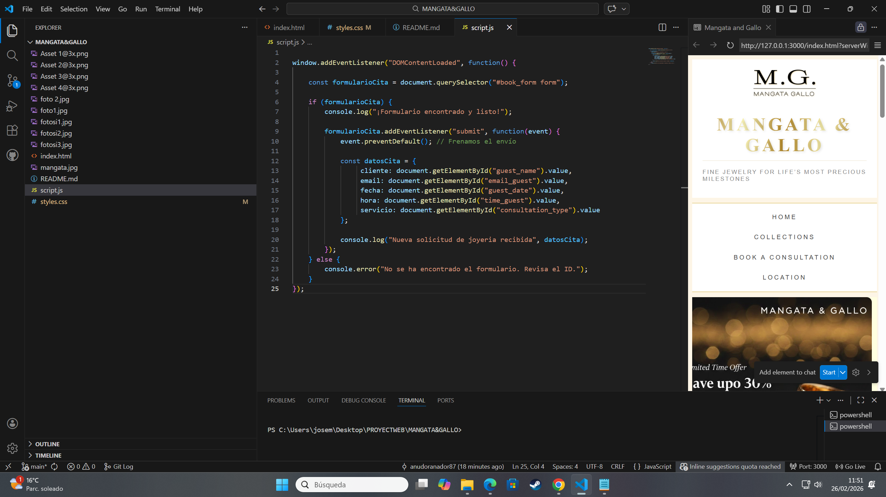

# 📓 THE 365-DAY DEV JOURNEY: Jose Aparicio ES-VERSION

🇬🇧 [English Version](./README.md) &nbsp;|&nbsp; 🇪🇸 Versión Española

> **"La lógica es mi superpoder, la sintaxis es solo la herramienta."**

## 🚀 MI "UPGRADE" DE CARRERA: DE HOSPITALITY A WEB DEVELOPER

Este diario no es solo una lista de temas estudiados; es el **registro de ingeniería** de mi transición profesional. Tras más de 8 años gestionando equipos y resolviendo crisis en el sector de la **Hostelería (UK y España)**, estoy aplicando esa misma resiliencia y capacidad de resolución al mundo del desarrollo de software.

### 🛠️ ¿QUÉ VAS A ENCONTRAR EN ESTE LOGBOOK?
Para un reclutador, la duda siempre es: *¿Realmente sabe resolver problemas?*. Aquí documento mi lucha diaria, mis errores de lógica y mis victorias técnicas para demostrar tres cosas:

* **Consistencia Inquebrantable:** Un registro diario de mi evolución, sin filtros.
* **Mentalidad de Debugging:** No solo muestro el código que funciona, sino cómo **"derribé el edificio"** para construir cimientos más sólidos cuando las cosas se pusieron difíciles.
* **Seniority en Actitud:** Mi experiencia previa no es un paréntesis; es el **motor** que acelera mi capacidad de aprendizaje y mi visión de producto orientada al usuario real.

# 🧭 Roadmap de Aprendizaje (Vista Mensual)

| Mes | Tema Principal | Proyectos y Retos | Habilidades Clave |
| :--- | :--- | :--- | :--- |
| **Enero** | ✅ **Fundamentos Web (freeCodeCamp)** | Web Campus & Crema Teatinos, Formularios de Registro | HTML5 Semántico, CSS3, Maquetación básica. |
| **Febrero** | 🔥 **Especialización CSS & JS (Meta)** | Mangata & Gallo, Juego de Cartas, App de Reservas (WIP), Sistema de Niveles | CSS in Depth, Lógica de Arrays, Funciones, Manipulación del DOM. |
| **Marzo** | 🏗️ **Próximamente** | *Por definir...* | *Por definir...* |

---

## 🗓️ [Día 20 de Febrero, 2026]
### 📝 Resumen del Día
Hoy he alcanzado mi primer **"clic" mental importante**. Mi enfoque no ha sido solo escribir líneas de código, sino dominar el arte del **debugging** y entender el flujo de control profundo en JavaScript y la jerarquía de selectores en CSS.

### 🛠️ Conceptos Técnicos Dominados:

* **💻 JavaScript: Lógica y Estructura**
    * **Gestión de Variables:** Perfeccioné el uso de `let` y la reasignación dinámica.
    * **Template Literals:** Implementé el uso de backticks (`` ` ``) para inyectar variables en strings de forma limpia.
    * **Operador de Módulo (%):** Clave para resolver la lógica de precios según productos pares/impares.
    * **Scope de Bloque:** Entendí por qué las variables declaradas con `let` viven y mueren dentro de las llaves `{}`.

* **🎨 CSS: Maquetación y Selectores**
    * **Box Model:** Análisis profundo de **padding**, **border** y **margin** para evitar el desbordamiento de contenedores.
    * **Interacción (UX):** Uso de pseudoclases `:hover` para feedback visual.
    * **Selectores de Relación:** `+` (Hermano adyacente) y `~` (Hermano general).

### 🧩 Resolución de Problemas (Debug Log)
* **Logro del momento:** He construido mi primer periódico digital desde cero. 
* **Correcciones:** He corregido errores de sintaxis en **text-transform** y he aprendido a diferenciar **font-weight** de **font-family**. 
* **Estado:** Mi estructura de **Flexbox** está empezando a tener sentido.

> **💡 Mi Nota Mental:** "La lógica es mi superpoder, la sintaxis es solo la herramienta."

---

## 🗓️ [Día 22 de Febrero, 2026]
### 🔨 Forjando el Formulario de Odin project
Hoy he terminado el proyecto del formulario de registro y, sinceramente, **el cambio de nivel se nota**. No solo he picado código, sino que he tomado decisiones de diseño y he usado herramientas profesionales.

### 🧠 Lo que he aprendido hoy:
* **📐 Grid y Alineación Real:** He dominado cómo dividir la pantalla en columnas (`2fr 3fr`) y cómo usar `grid-template-columns: 1fr 1fr` dentro del formulario para que todos los inputs queden perfectamente alineados en parejas sin que se muevan según el texto.
* **🖋️ Jerarquía Tipográfica:** He reservado la fuente **Norse** para el branding y el botón de acción, y he usado **Inter** para que los textos largos y los labels se lean sin esfuerzo.
* **🌑 Sombras con Intención:** He pasado de las sombras genéricas que no me gustaban a crear una sombra direccional (**Bottom Shadow**) usando el eje Y (`box-shadow: 0 8px 15px rgba(0,0,0,0.1)`). Ahora el formulario parece que flota, no que está sucio.
* **✨ Micro-interacciones:** He configurado un efecto `:hover` profesional que no solo cambia el color, sino que eleva el botón con `transform: translateY(-3px)`. Se siente **"vivo"**.

---

## 🗓️ [Día 23 de Febrero, 2026]
### 🚀 "Hoy he dejado de hacer una web 'que funciona' para hacer una web profesional"
Hoy ha sido un día de una **intensidad brutal**. He saltado del diseño visual a la lógica pura, enfrentándome a problemas que separan a los aficionados de los desarrolladores reales. 

### 📱 La Batalla por la Adaptabilidad (Responsive Design)
No me he conformado con que la web se vea bien en mi monitor. He luchado con las **Media Queries** para que la experiencia sea fluida en móviles y tablets:
* **El cambio de estrategia:** He tenido que refactorizar el contenedor principal. Lo que en escritorio era un Grid organizado, en pantallas pequeñas lo he transformado en un Flexbox con `flex-direction: column`.
* **Superando el Caos del CSS:** Mi mayor dificultad aquí ha sido la **Cascada de CSS**. Los estilos globales se daban de bofetadas con los de las Media Queries. He tenido que aprender a priorizar y organizar mis selectores para que la web no se **"rompiera"** al encoger la ventana.

### 🎨 Perfeccionando la Experiencia (UI & UX Avanzado)
He querido que el usuario sienta que está en una web de calidad premium:
* **🔍 Validación Inteligente:** He implementado la pseudoclase `:user-invalid`. Me volví loco al principio porque los bordes rojos salían nada más cargar la página, lo cual era súper agresivo. Ahora, el feedback solo aparece después de que el usuario interactúa. Es un detalle de **"pro"**.
* **⚡ Micro-interacciones:** He añadido efectos de `transition` y `transform` en los `input:focus`. Ahora los campos **"reaccionan"** cuando vas a escribir, dándole un toque táctil y moderno.
* **✍️ Tipografía de Élite:** He configurado las fuentes **'Norse'** e **'Inter'** ajustando el `letter-spacing`. He aprendido que el diseño está en los detalles invisibles.

### 🥊 JavaScript y la Lógica de Reservas (El gran reto)
> **"De la frustración al éxito: Cómo construí el motor de Campus & Crema"**

1.  **El Momento del "Borrón y Cuenta Nueva":** Empecé el día con un código que era una jungla. En lugar de seguir poniendo parches, tomé la decisión más difícil pero más inteligente: **empezar de cero**. He aprendido que, en programación, a veces hay que derribar el edificio para construir unos cimientos sólidos. He definido mi Array de `mesasOcupadas` con precisión, entendiendo que cada dato cuenta.
2.  **El Laberinto de la Sintaxis (Mis dificultades):**
    * **La guerra de los símbolos:** Al principio me volvía loco con el `=` y el `===`. Me frustraba ver que el **"semáforo"** no cambiaba de color. He descubierto que usar `(estaOcupada === true)` dentro de un bucle es como hacer una pregunta al aire sin anotar la respuesta. La solución fue entender que necesitaba una orden directa: `estaOcupada = true;`.
    * **El caos de los paréntesis y llaves:** Ha sido mi mayor reto. He tenido errores de **"gramática"** de código que me daban ganas de mandarlo todo a paseo. Paréntesis que abrían pero no cerraban, o ese `if` que se quedaba cojo por no tener su **"cajita"** de paréntesis.
    * **El punto y coma traicionero:** Hubo un momento en que puse un punto y coma justo después de un `for`, bloqueando todo el motor. Aprender a **"ver"** estos errores invisibles ha sido un entrenamiento visual increíble.

> **🧠 Reflexión Final (Error Lógico):** Hoy he visto que el desarrollo web es un equilibrio. De nada sirve un JS perfecto si la web se ve mal en un iPhone, y de nada sirve un CSS precioso si el botón de reserva no sabe distinguir una hora libre de una ocupada. El error lógico de hoy ha sido entender que el diseño y la lógica son un solo cuerpo.

---

## 🗓️ [Día 24 de Febrero, 2026]
### 🏋️ "Sesión de Entrenamiento: Algoritmos y Estructuras de Datos"

### 🚀 Logros del día (Basados en ejercicios)
* **💼 Resolución de Casos de Uso:** He realizado una serie de ejercicios prácticos simulando entornos reales (E-commerce, Sistemas de Login y Perfiles de Usuario).
* **⚙️ Construcción de Lógica Dinámica:** A través de retos, he aprendido a generar estructuras de HTML dinámico mediante funciones y **Template Literals**.
* **📂 Arquitectura de Información:** He practicado la anidación de datos, integrando **Arrays dentro de Objetos** para gestionar perfiles complejos.

### 🥊 La "pelea" con el código (Aprendizaje basado en errores)
Hoy la sesión de prácticas ha sido un **"combate" constante** contra la sintaxis y la lógica:
* **⚔️ Guerra de Símbolos:** Durante los ejercicios, me **"pelee"** con el uso de `()` vs `{}` vs `[]`. Tras varios intentos fallidos, he consolidado que las llaves son para objetos y los corchetes para listas.
* **↪️ El desafío del "Return":** En las prácticas de funciones, identifiqué el error común de intentar usar **return** fuera de su ámbito o confundirlo con **console.log**.
* **🧪 Mutación vs Asignación:** En el reto de gestión de inventario, sufrí las consecuencias de usar `=` en lugar de `.push()`, aprendiendo por las malas cómo un error de asignación puede destruir una base de datos de strings.


## 🗓️ [Día 25 de Febrero, 2026]

### 🚀 [Logros del Día](#)

* **`🔵 Motor de Estado Circular`**: Creación de un bucle lógico que incrementa del 1 al 10 y reinicia a `0` al llegar al nivel 11.

* **`🔵 Modo Legendario`**: Disparador visual (escala, bordes dorados y brillo) al alcanzar el nivel máximo.

### 🥊 [La "Pelea" con el Código (Depuración Real)](#)

* **↪️ El Conflicto del Else (Limpieza Prematura):**
    * **Fallo:** Al volver a 0, el efecto dorado desaparecía tan rápido que mataba la experiencia del usuario.
    * **Solución:** Reorganización del flujo `if/else` para priorizar la persistencia visual del hito alcanzado.

* **🧪 Pesadilla de Sintaxis:**
    * **Fallo:** Código muerto por un paréntesis extra `{(this...` y por usar puntos `.` dentro de `classList`.
    * **Solución:** Consolidación de sintaxis: `classList` no lleva punto y los bloques de código deben estar limpios de caracteres huérfanos.

    ### 🏆 [Prueba visuual del logro](#)
    
    
  
    
    ---

### 🏋️ "Sesión de Entrenamiento por la tarde : Diagnóstico y Gestión de Errores en JS (Meta - Coursera)"

### 🚀 Logros del día
* **`🔴 Formación Especializada`**: Avance en el curso de **Meta en Coursera**, profundizando en la resiliencia del código a través de la gestión de errores.
* **`🔴 Clasificación de Errores`**: Identificación y resolución de los 4 jinetes del apocalipsis en JS: **Reference**, **Type**, **Range** y **Syntax**.
* **`🔴 Estructuras de Control de Fallos`**: Implementación de bloques `try...catch` para crear aplicaciones profesionales que no se detienen ante fallos inesperados.
* **`🔴 Anatomía del Objeto Error`**: Uso de las propiedades `.name` y `.message` para extraer información crítica durante el debugging.

### 🥊 La "pelea" con el código (Tipos de errores detectados)

* **⚔️ El Error de Referencia (ReferenceError):** * **Fallo:** Llamar a una variable no declarada.
    * **Lección:** Sin `let` o `const`, JavaScript no encuentra el "personaje" en memoria.
* **⚔️ El Conflicto de Tipos (TypeError):** * **Fallo:** Usar métodos incompatibles (ej: `.toUpperCase()` en un número).
    * **Lección:** Cada tipo de dato tiene sus propias herramientas; no puedes batir un huevo con un destornillador.
* **⚔️ Fuera de Rango (RangeError):** * **Fallo:** Valores numéricos fuera de los límites legales (ej: `new Array(-1)`).
    * **Lección:** Forzar los límites lógicos de JS detiene el motor de ejecución.
* **⚔️ La Barrera de la Sintaxis (SyntaxError):** * **Fallo:** Olvidar una llave `}` o un paréntesis `)`.
    * **Lección:** Es un error de gramática que impide que el código siquiera arranque.

### 🧠 Reflexión de Ingeniería: El Error Lógico
Gracias a los materiales de **Meta**, hoy he interiorizado que los errores lógicos son los más críticos porque la consola no te avisa. La revisión constante y el pensamiento crítico son nuestra mejor defensa.

---


# 
# 📔 Diario de Bitácora - Jose María
## 📅 Fecha: 26 de febrero de 2026
## 🎯 Estado: Superación y Comprensión Profunda

---

### 📖 El Contexto: El Examen de Coursera
Hoy completé el examen oficial de **Coursera** sobre funciones en JavaScript. El sistema marcó un aprobado, pero para mí no era suficiente. El examen se centraba mucho en la teoría: el uso de `%c` para dar formato a la consola, el manejo de variables locales y el encadenamiento básico. 

A pesar de tener el certificado, sentía que la **"pesadilla de la sintaxis"** seguía ahí. No entendía del todo cómo los datos viajaban de una función a otra ni por qué usábamos ciertos símbolos. El examen era una prueba de memoria; yo quería una prueba de lógica.

---

### 🚀 La Decisión: Ir más allá de la teoría
Inconforme con solo "pasar el test", decidí bajar el código al suelo. Aparqué los ejercicios teóricos y me propuse construir un **Caso Real: Un Generador de Tickets de Supermercado**. 

Mi objetivo era entender tres cosas que el examen no me terminaba de aclarar:
1.  **El origen de los datos:** ¿De dónde salen las variables si no están definidas arriba? (Entendido: Parámetros como asientos reservados).
2.  **La comunicación:** ¿Cómo le pasa una función el resultado a la siguiente? (Entendido: El flujo del `return` al argumento).
3.  **La activación:** ¿Por qué no puedo usar el signo `+` para llamar a una función? (Entendido: El uso de los paréntesis `()` como el único interruptor real).

---

### 🛠️ El Logro Técnico: Arquitectura Modular
He diseñado un sistema de tres niveles que ahora entiendo a la perfección:
* **Procesador:** `formatearPrecio` (Transforma el número en dinero).
* **Interfaz:** `imprimirTicket` (Muestra el mensaje al humano).
* **Controlador:** `realizarCompra` (La jefa que coordina el flujo entre ambas).

---

### 🥊 Batalla de Debugging (Lo que realmente aprendí)
* **Error de concepto:** Intentar sumar funciones con `+`. Corregido al entender que la función se **invoca**.
* **Error de sintaxis:** Mezclar `${}` con paréntesis. Aprendí que los Template Literals son quirúrgicos: si no cierras bien la llave, el código muere.
* **El momento "Click":** Entender que `producto` y `precio` son nombres temporales que yo elijo para que el código sea legible para otros humanos.

---

### 📸 Estructura del Código Final

```javascript
function formatearPrecio(cantidad) {
    return `€${cantidad}`;
}

function imprimirTicket(producto, precioConSimbolo) {
    console.log(`Has comprado: ${producto} por un total de ${precioConSimbolo}`);
}

function realizarCompra(nombreArticulo, valorNumerico) {
    let resultado = formatearPrecio(valorNumerico);
    imprimirTicket(nombreArticulo, resultado);
}
```
// La llamada que lo inicia todo:
realizarCompra("Manzanas", 5);

---

## 💎Avances con el "Proyecto": Mangata & Gallo - Implementación de Formulario

**Objetivo:** Construcción y conexión del formulario de consulta para el catálogo de joyería.

* **Integración de JavaScript:** He vinculado el formulario a un archivo `script.js` mediante la etiqueta `<script>` al final del body.
 Mi meta es aplicar la lógica de funciones que he practicado hoy para gestionar el envío.
* **Gestión de Activos (Assets):** Aplicación de CSS al fondo del formulario para mantener la estética de marca (lujo y precisión) sin distorsionar las imágenes de fondo.

### ⚠️ Deuda Técnica (Estado Actual)
* **Lógica Funcional:** El script está vinculado, pero estoy refinando la captura de datos.
* **El "Combate":** Estoy depurando un error lógico donde los datos no se capturan correctamente en el evento `submit`. 
Voy a aplicar la estructura de "Función Maestra" que aprendí hoy para organizar mejor este proceso.
* **Meta:** Lograr un sistema de validación total para la sección de contacto.




## 🗓️ [Día 27 de Febrero, 2026]
### 🎯 Estado: Comprensión de JavaScript aplicado a componentes e interfaces

---

### 🌓 El Logro: Modo Oscuro Nativo
Hoy he finalizado la implementación de un **Modo Oscuro** funcional en mi portafolio web. Tras varias sesiones de trabajo, he logrado que la interfaz se adapte a las preferencias del usuario, mejorando la accesibilidad y la salud visual.

#### 🛠️ ¿Cómo lo he hecho?

1. **Lógica con JavaScript**: Utilicé manipulación del DOM para crear un *Event Listener* que detecta el clic en el botón de cambio de tema, activando un `classList.toggle('dark-mode')` en el cuerpo del documento.
2. **Arquitectura CSS (Design Tokens)**: En lugar de cambiar colores de forma individual, diseñé un sistema de **Variables CSS (`Custom Properties`)**. Esto permite que el cambio de tema sea centralizado y escalable.


#### ⚔️ Dificultades y Aprendizaje
***Orden vs. Caos**: Me enfrenté a una selva de estilos duplicados y colores fijos (*hardcoded*) que bloqueaban la herencia. Limpiar el código fue vital para que las variables funcionaran.
***Sintaxis Estricta**: Descubrí que el CSS es implacable; una llave `}` mal cerrada invalidaba secciones enteras. Aprendí que la jerarquía y el orden son la base de un desarrollo profesional.

#### 🚀 Resultado
He pasado de un archivo desordenado a una arquitectura limpia que impresiona por su eficiencia.


### 📓 Bitácora de Aprendizaje - JavaScript POO
**Sesión:** Profundización en POO y Herencia (Curso de Meta)

#### 📝 Resumen del Progreso (Metodología STAR)

***S (Situación):** 📍 Me encontraba avanzando en el curso de **Meta**, enfrentándome a conceptos de POO que me resultaban muy abstractos y difíciles de visualizar en la práctica.
***T (Tarea):** 🎯 El objetivo era comprender y aplicar la jerarquía de clases y la herencia en JavaScript, pasando de la teoría a la construcción de un modelo funcional de `Persona` y `Empleado`.
***A (Acción):** 🛠️ Diseñé y depuré una estructura de clases donde:
    * Implementé `extends` para establecer la herencia entre clases.
    * Corregí la implementación de `super()`, comprendiendo su función como invocador del constructor padre.
    * Aseguré el acceso correcto a los datos mediante `this` y optimicé la salida de datos utilizando **Template Literals** (backticks).
***R (Resultado):** ✅ Logré aterrizar conceptos complejos en un código sólido y funcional. He consolidado el dominio de la mecánica de herencia, lo que me permite estructurar aplicaciones más escalables.


---

---
# 📔 Diario de Bitácora - Jose María
## 📅 Fecha: 28 de febrero de 2026
## 🚀 Fase 1: Cimientos de la Arquitectura EquiShift Málaga

---

#### 🌟 SITUATION (El Desafío de la Justicia Horaria)
En mi entorno laboral en Málaga, he detectado que la gestión manual de turnos falla en lo más sagrado: **la equidad del descanso**. La complejidad de mezclar contratos de 37.5h y 40h hace que, a final de año, el reparto de fines de semana libres sea desigual e injusto ,con el objetivo de dar solucion a una problematica real, voy a desarrollar estos meses la aplicacion EquiShift.

**Objetivo de hoy:** Diseñar un núcleo lógico que garantice que **todos libren los mismos fines de semana al año**. No busco solo una tabla de Excel; busco codificar un sistema de rotación matemática donde el horario sea, por primera vez, igualitario para todos.
---
### 🎯 TASK (Tarea de Inicio)
1.  **Modelado de Datos (WIP):** Definir la estructura de objetos para empleados. No es una lista final, sino un prototipo funcional.
2.  **Dataset de Localización:** Mapear el calendario de **Málaga 2026**.
3.  **Lógica de Rotación (Investigación):** Estudiar el uso de aritmética modular (`%`) para la futura rueda de turnos.

---

### 🛠️ ACTION (Acción y Desafíos)

**1. Definición de Estructuras (Objetos Iniciales)**
He creado el array `trabajadores`. La clave aquí ha sido la **escalabilidad**:
* Cada objeto tiene metadatos de contrato y bolsas de días.
* He dejado preparado el array `calendario: []`. Está vacío porque aún no he construido el motor que lo rellena, pero la "percha" ya está instalada.

**2. Mapeo de Festivos Locales**
He inyectado en código fechas clave como el 19 de agosto (Feria) y el 8 de septiembre (Victoria).
* **Dificultad técnica:** Entender cómo JavaScript maneja las fechas comparándolas con strings. He decidido usar el formato `YYYY-MM-DD` para evitar errores de zona horaria en esta fase inicial.
* 
### 📂 Estructura del Modelo de Datos (Extracto)
Para garantizar la escalabilidad y la **equidad algorítmica**, cada empleado se define mediante un objeto con metadatos específicos:

```javascript
{ 
  id: 1, 
  nombre: "Jose María", 
  contrato: 37.50,         // Base para el cálculo de exceso de jornada
  festivosDisponibles: 13, // Saldo dinámico según convenio Málaga 2026
  vacacionesDisponibles: 28, 
  calendario: []           // Target para el volcado del bucle maestro
}
```

**3. Debug Log (La "Pelea" del día)**
* **Anidación de Datos:** Me he peleado con la sintaxis de los objetos dentro de arrays. Un simple error en una coma o una llave `{}` me ha recordado que en la Fase 1, la **disciplina sintáctica** es más importante que la velocidad.
* **Lógica de Descuento:** He esbozado la lógica `Bolsa--`, pero aún no está automatizada. He detectado que necesito un validador que impida que el saldo sea negativo.
---
### 🏆 RESULT (Hitos Logrados hoy)
* ✅ **Esqueleto Funcional:** No tengo la App, pero tengo el **mapa genético** de la misma.
* ✅ **Dataset Validado:** Los festivos de Málaga 2026 ya están integrados en el entorno de desarrollo.
* ✅ **Claridad de Arquitectura:** He pasado de la idea mental a una estructura de objetos interconectados.

---

### 🚧 PRÓXIMOS PASOS (Deuda Técnica)
* [ ] **Motor de Bucle:** Construir el `for` que recorra los 365 días.
* [ ] **Algoritmo de Equidad:** Aplicar el operador `%` para que la rotación de fines de semana sea automática.
* [ ] **Validador de Contratos:** Diferenciar automáticamente el trato de los festivos para los contratos de 37.5h.

---
---

### 🏋️ Sesión de Entrenamiento: Fundamentos y Agilidad (Tarde)

**Objetivo:** Ganar fluidez en la escritura de sintaxis moderna y manipulación de datos complejos para preparar el motor de rotación de **EquiShift**.

* **Estructuras de Datos:** Práctica intensiva en la **anidación de Objetos dentro de Arrays**. He consolidado la capacidad de acceder y modificar propiedades específicas de empleados (como `festivosDisponibles`) recorriendo la lista mediante bucles.
* **Lógica Funcional (ES6+):** Implementación de **Arrow Functions** para cálculos rápidos. He migrado lógica tradicional a funciones de flecha para procesar variables de `intensidad` y `salario`, optimizando la limpieza del código.
* **Control de Flujo:** Uso de **bucles `for`** para simular el recorrido cronológico de días, validando condiciones de descanso mediante **condicionales `if/else`** anidados.

#### 🥊 Debug Log (Desafíos Superados)

* **Disciplina Sintáctica:** Superada la "batalla de las llaves" `{}` y las comas en estructuras complejas. He interiorizado que un error de puntuación es un error de arquitectura.
* **Precisión de Propiedades:** Corrección recurrente de la propiedad `.length`. He automatizado la detección de este error tipográfico, ganando velocidad en el *debugging* visual.
  
> [!IMPORTANT]
> **Mi reflexion:** > *"Hoy he comprendido que el código es justicia, pero la justicia requiere cimientos firmes. EquiShift está en su infancia; la mayor dificultad no es escribir el código, sino diseñar una estructura que no se rompa cuando el algoritmo de rotación se vuelva complejo."*

---

# 📔 MI DIARIO: RETO 365 DÍAS

## 📅 Fecha: 1 de marzo de 2026
**Estado:** Cabeza llena, pero orgulloso.
---

### 🧠 La Realidad del Aprendizaje
Estas semanas han sido intensas. No ha sido solo una plataforma; ha sido un bombardeo constante de conceptos cruzados entre **freeCodeCamp** y **Coursera**:
* **Maquetación:** HTML, CSS y estructuras.
* **Assets:** Gestión de rutas e imágenes.
* **Lógica JS:** Arrays, objetos, bucles `for...of` y *backticks*.

Demasiadas piezas nuevas intentando encajar en muy poco tiempo.

### 🏆 La Victoria
Hoy por fin tuve el **“clic”**. Entendí cómo sacar datos de los objetos sin sentir que estaba adivinando. Pasar de la duda al control absoluto de la sintaxis se siente enorme. 

### 🛑 Parada Estratégica
Actualmente me siento **saturado**, que no bloqueado. Justo ahora me voy de vacaciones unos días fuera y el *timing* es perfecto:
* **Desconexión:** Cambiar de entorno y alejarme del ordenador.
* **Recuperación:** Dormir mejor y resetear el sistema.
* **Asimilación:** Dejar que el cerebro procese toda la información en segundo plano sin forzarlo.

> "No es abandonar, es dejar que el cerebro haga su trabajo. Aprender también es saber cuándo parar."

---

### 🚀 Conclusión
Me voy tranquilo porque me voy después de una **victoria**. Sé que cuando vuelva, muchas cosas que hoy me han costado esfuerzo saldrán de forma natural. 

**¡Nos vemos después del descanso!**

---

---

# 📔 MI DIARIO: RETO 365 DÍAS

## 📅 Fecha: 8 de marzo de 2026
## 🎯 Estado: Primer "clic" real con Arrow Functions y Parámetros por Defecto

---

### 📝 Resumen del Día (Metodología STAR)

* **S (Situación):** 📍 Varios días con Jonas Schmedtmann trabajando tipos de funciones. Sabía escribir Function Declarations porque era lo único que conocía. Hoy me enfrenté a reescribir código real usando Arrow Functions por primera vez — sin red de seguridad.
* **T (Tarea):** 🎯 Refactorizar la función `formatearPrecio` del Día 26 convirtiéndola en una Arrow Function con parámetro por defecto (`€`).
* **A (Acción):** 🛠️ Sesión del Cuaderno de Pitágoras — pistas graduales, sin soluciones directas. Construí la función en capas: estructura básica → segundo parámetro → orden del template literal → concepto de default.
* **R (Resultado):** ✅ Función construida desde cero, con comprensión real de cada parte.

---

### 🛠️ Conceptos Técnicos Dominados Hoy

#### 💻 Arrow Functions — Las Tres Zonas

* **ZONA 1 — Parámetros** (antes de `=>`): qué datos va a recibir la función.
* **ZONA 2 — La flecha `=>`**: el operador que conecta entrada con salida.
* **ZONA 3 — El cuerpo** (después de `=>`): donde usas los datos y devuelves algo.

> La confusión de hoy era meter datos de la Zona 3 en la Zona 1. Como contratar a un empleado sin decirle su nombre y luego llamarle por el pasillo.

#### 💡 Parámetros por Defecto

Cuando un parámetro lleva `= valor`, JavaScript usa ese valor si no se pasa nada:
```javascript
formatearPrecio(5);        // moneda = "€" automático → "€5"
formatearPrecio("£", 5);   // moneda = "£" → "£5"
```

#### 📐 Function Declaration vs Arrow Function
Antes usaba Function Declarations porque era lo único que conocía. Hoy sé que la elección tiene que ser **consciente**, no por defecto.

---

### 🥊 La Pelea con el Código (Debug Log Real)

* **Intento 1 — Error de concepto total:**
    * `const maquinaFormato = formatearPrevio => 5:`
    * **Fallo:** Confundí el nombre de la función con el parámetro. Dos puntos en lugar de flecha.
    * **Lección:** El parámetro es un nombre temporal, no un valor fijo.

* **Intento 2 — El valor fijo en el parámetro:**
    * `const formatearPrecio = 5 =>`
    * **Fallo:** El `5` es un valor concreto, no un asiento reservado.
    * **Lección:** Los parámetros son asientos reservados, no pasajeros concretos.

* **Intento 3 — Template literal sin cerrar:**
    * `const formatearPrecio = cantidad => \`€${cantidad}`
    * **Fallo:** El backtick de cierre no estaba. El código moría en silencio.
    * **Lección:** Todo lo que abre necesita cerrarse. Sin excepción.

* **Intento 4 — El orden invertido:**
    * `${cantidad}${moneda}` → devuelve `"5€"` en lugar de `"€5"`
    * **Lección:** El orden dentro del template literal es el orden en pantalla.

* **Intento 5 — El "bb" al final:**
    * `\`${cantidad} ${moneda} bb\``
    * Señal clara de saturación. **Pausa estratégica aplicada.**

#### ✅ Resultado Final
```javascript
const formatearPrecio = (moneda = "€", cantidad) => `${moneda}${cantidad}`;
```

---

### 🧠 Reflexión Final — El Ángulo Recto

Durante 8 años en hostelería aprendí que hay dos tipos de empleados: los que hacen lo que siempre se ha hecho porque *"así funciona"*, y los que entienden **por qué** se hace así y pueden adaptarlo cuando cambia el contexto.

Hoy era el primer tipo con las funciones. A partir de ahora voy a ser el segundo: **el que elige conscientemente**.

> **💡 Nota Mental:** *"Un parámetro no es un valor. Es un asiento reservado para cualquier valor que llegue."*

---
# 🗓️ [Día 18 — 9 de Marzo, 2026]
🎯 **Estado:** Destructuring, forEach, filter, map — y el primer bloque funcional de EquiShift

---

### 📝 Resumen del Día (Metodología STAR)

* **S (Situación):** 📍 Sesión del Cuaderno de Pitágoras. Lab de Coursera Meta sobre destructuring y métodos de arrays. Cuatro conceptos en una sola sesión — ninguno interiorizado al empezar.
* **T (Tarea):** 🎯 Interiorizar destructuring de arrays y objetos, y dominar `forEach`, `filter` y `map` hasta poder combinarlos en un ejercicio encadenado real.
* **A (Acción):** 🛠️ Cada concepto construido en capas con pistas graduales. Repetí ejercicios hasta eliminar errores recurrentes. El ejercicio final combinó `filter` + `map` + `forEach` en una cadena real. Al cierre, apliqué todo al código de EquiShift.
* **R (Resultado):** ✅ Los cuatro conceptos resueltos con comprensión real. La cadena `filter → map → forEach` funcionó a la primera en lógica. Primer bloque funcional de EquiShift escrito.

---

### 🛠️ Conceptos Técnicos Dominados Hoy

#### 💻 Destructuring — Arrays y Objetos

* **Array destructuring** — los nombres son libres, manda la **posición**:
```javascript
const [secondProductName, secondProductPrice] = products[1];
// → "Phone", 500
```

* **Object destructuring** — los nombres tienen que **coincidir** con las propiedades:
```javascript
const { title, author, timePosted } = review;
```

* **Saltar asientos** en arrays — coma vacía, sin valores, sin comillas:
```javascript
const [, segundo] = products; // salta el asiento 0
```

> En arrays manda el asiento. En objetos manda el nombre.

---

#### 💻 forEach, filter y map — Cuándo usar cada uno

| Método | ¿Devuelve algo? | ¿Para qué? |
|--------|----------------|------------|
| `forEach` | No | Recorrer y ejecutar algo |
| `filter` | Sí — array filtrado | Seleccionar elementos |
| `map` | Sí — array nuevo | Transformar elementos |

* **La regla de oro del forEach con objetos:**
`parámetro singular` + `.` + `nombre de la propiedad`

```javascript
empleados.forEach(function(empleado) {
    console.log(`${empleado.nombre} cobra ${empleado.salario}€`);
});
```

* **filter** — devuelve solo los que pasan la prueba:
```javascript
const disponibles = productos.filter(function(producto) {
    return producto.disponible === true;
});
```

* **map** — transforma cada elemento y devuelve array nuevo:
```javascript
const descuentos = resultado.map(function(item) {
    return { nombre: item.nombre, precio: item.precio * 0.80 };
});
```

---

#### 💻 La Cadena Completa — filter + map + forEach

```javascript
// PASO 1 — filter: solo disponibles
const resultado = productos.filter(function(producto) {
    return producto.disponible === true;
});

// PASO 2 — map: aplicar 20% descuento
const descuentos = resultado.map(function(descuento) {
    return {
        nombre: descuento.nombre,
        precio: descuento.precio * 0.80
    };
});

// PASO 3 — forEach: mostrar resultados
descuentos.forEach(function(item) {
    console.log(`${item.nombre} — ${item.precio}€`);
});
// → Camiseta — 12€
// → Gorra — 16€
```

> Cada método trabaja sobre el resultado del anterior. Eso es pensar en cadenas de datos.

---

### ⚙️ EquiShift — Aplicando lo aprendido al proyecto real

Al cierre de sesión apliqué `filter` y `forEach` directamente al código de EquiShift. No como ejercicio — como lógica real de negocio.

**Motor de Clasificación por Contrato** — primer bloque funcional del algoritmo:

```javascript
// Clasificar por tipo de contrato
const jornada375 = trabajadores.filter(function(trabajador) {
    return trabajador.contrato === 37.50;
});
// → Jose María, Salvador, Miguel (13 festivos)

const jornada40 = trabajadores.filter(function(trabajador) {
    return trabajador.contrato === 40;
});
// → Diego, Rafa (14 festivos)

// Verificar clasificación
console.log("--- Jornada 37.5h ---");
jornada375.forEach(function(mostrar) {
    console.log(`${mostrar.contrato}h — ${mostrar.nombre} — ${mostrar.festivosDisponibles} festivos`);
});

console.log("--- Jornada 40h ---");
jornada40.forEach(function(mostrar) {
    console.log(`${mostrar.contrato}h — ${mostrar.nombre} — ${mostrar.festivosDisponibles} festivos`);
});
```

> ¿Por qué filtrar por `contrato` y no por `festivosDisponibles`? Los festivos pueden cambiar por ley. El contrato es el dato más estable — siempre ancla tu lógica al dato que no cambia.

---

### 🥊 La Pelea con el Código (Debug Log Real)

* **Bug 1 — Strings en el lado izquierdo del destructuring:**
    * `const ["name", "work", years] = team[1]`
    * **Fallo:** Strings en el lado izquierdo — los valores, no las etiquetas.
    * **Lección:** El lado izquierdo siempre son nombres de variables. Sin comillas. Sin valores.

* **Bug 2 — El error de singular/plural:**
    * `empleados.salario` en vez de `empleado.salario`
    * **Fallo:** El array entero en vez del elemento individual.
    * **Lección:** `forEach`, `filter` y `map` pasan UN elemento. El parámetro siempre en singular.

* **Bug 3 — Objeto entero en vez de propiedad:**
    * `${item}` en vez de `${item.nombre}`
    * **Fallo:** `item` devuelve `[object Object]` — hay que llegar a la propiedad.
    * **Lección:** parámetro + punto + nombre de la propiedad. Siempre.

* **Bug 4 — Porcentaje confundido con suma:**
    * `precio + 0.80` en vez de `precio * 0.80`
    * **Fallo:** Sumar 0.80€ no es aplicar un descuento del 20%.
    * **Lección:** Un descuento del 20% es multiplicar por 0.80.

* **Bug 5 — map sobre el array original en vez del filtrado:**
    * `productos.map(...)` en vez de `resultado.map(...)`
    * **Fallo:** Saltarse el filtro — se aplicaría el descuento a productos no disponibles.
    * **Lección:** En una cadena, cada paso trabaja sobre el resultado del anterior.

#### ✅ Resultado Final

```javascript
// La cadena completa — filter → map → forEach
const resultado = productos.filter(p => p.disponible === true);
const descuentos = resultado.map(p => ({ nombre: p.nombre, precio: p.precio * 0.80 }));
descuentos.forEach(item => console.log(`${item.nombre} — ${item.precio}€`));
```

---

### 🧠 Reflexión Final — El Ángulo Recto

Hoy entendí que `forEach`, `filter` y `map` no son tres métodos distintos — son tres formas de pensar sobre los datos. Antes los veía como herramientas separadas. Ahora los veo como una cadena de montaje donde cada eslabón tiene un trabajo concreto.

Y lo más importante: los apliqué a un problema real. EquiShift ya tiene su primer bloque funcional — no porque lo copiara de un tutorial, sino porque entendí el problema y supe qué herramienta usar.

> **💡 Nota Mental:** *"filter filtra, map transforma, forEach muestra. Cada uno tiene un trabajo. No los mezcles."*

## 🗓️ [Día 19 — 10 de Marzo, 2026]
🎯 **Estado:** Prueba de nivel sin Google — 4/5 resueltos · Spread operator en EquiShift · Roadmap del juego de cartas

---

### 📝 Resumen del Día (Metodología STAR)

* **S (Situación):** 📍 Después de 18 días de sesiones guiadas surgió una duda real: ¿estoy resolviendo problemas o solo reconociendo patrones cuando los veo? Decidí hacer una prueba de nivel real — sin documentación, sin Google, sobre datos reales de mis proyectos.
* **T (Tarea):** 🎯 Resolver 5 problemas usando `filter`, `forEach` y `map` sobre el mazo de We Playing Cards y la plantilla de trabajadores de EquiShift. Sin ayuda externa. Solo la lógica.
* **A (Acción):** 🛠️ Ataqué los problemas por orden de dificultad. Identifiqué el método correcto antes de escribir una línea. En el Problema 4 apliqué `map + if/else + spread` para actualizar EquiShift — primera vez usando spread operator en código de producción real.
* **R (Resultado):** ✅ 4/5 problemas resueltos. Lógica correcta en todos. Los errores fueron solo de sintaxis — paréntesis, llaves, template literals. El Problema 5 queda pendiente para el Día 20.

---

### 🛠️ Conceptos Técnicos Dominados Hoy

#### 💻 `filter()` — Seleccionar con condición

```javascript
// Filtrar solo las cartas activas del mazo
const cartasActivas = mazo.filter(function(carta) {
    return carta.activa === true;
});

// Mostrar nombres de las cartas activas
cartasActivas.forEach(function(carta) {
    console.log(carta.nombre);
});
```

> `filter` devuelve un array nuevo. Nunca modifica el original.

---

#### 💻 `map()` — Transformar sin mutar

```javascript
// Aumentar el ataque de todas las cartas en 10
const mazoPotenciado = mazo.map(function(carta) {
    return {
        nombre: carta.nombre,
        ataque: carta.ataque + 10
    };
});
```

> `map` transforma cada elemento y devuelve un array nuevo del mismo tamaño. El original queda intacto.

---

#### 💻 `map + if/else + spread` — Actualización condicional sin mutación

El patrón más importante del día. Aplicado directamente en EquiShift:

```javascript
// Actualizar festivos disponibles según tipo de contrato
const trabajadoresActualizados = trabajadores.map(function(trabajador) {
    if (trabajador.contrato === 40) {
        return { ...trabajador, festivosDisponibles: 14 };
    } else {
        return { ...trabajador, festivosDisponibles: 13 };
    }
});
```

**¿Por qué `...spread` y no asignación directa?**

```javascript
// ❌ Mutación directa — modifica el objeto original
trabajador.festivosDisponibles = 14;

// ✅ Spread — copia todas las propiedades y sobreescribe solo la que necesitas
return { ...trabajador, festivosDisponibles: 14 };
```

> El spread `...` copia todas las propiedades del objeto y solo sobreescribe la que especificas. El original queda intacto. Eso es inmutabilidad en la práctica.

---

#### 💻 Mental Model — Tres métodos, tres trabajos

| Método | ¿Devuelve algo? | ¿Para qué? |
|--------|----------------|------------|
| `filter()` | Sí — array filtrado (mismo tamaño o menor) | Seleccionar elementos |
| `map()` | Sí — array nuevo (mismo tamaño, elementos transformados) | Transformar elementos |
| `forEach()` | No | Ejecutar una acción por cada elemento |

```
filter()  → selecciona elementos que cumplen una condición
map()     → transforma cada elemento, devuelve array nuevo
forEach() → ejecuta acción por cada elemento, no devuelve nada
spread... → copia propiedades de un objeto sin mutarlo
```

---

### 🃏 EquiShift y We Playing Cards — Aplicando lo aprendido

#### ⚙️ EquiShift — Spread operator en producción

Primera aplicación real del spread operator al modelo de datos de EquiShift:

```javascript
const trabajadoresActualizados = trabajadores.map(function(trabajador) {
    if (trabajador.contrato === 40) {
        return { ...trabajador, festivosDisponibles: 14 };
    } else {
        return { ...trabajador, festivosDisponibles: 13 };
    }
});

// Jose María → 13 festivos ✓
// Salvador   → 13 festivos ✓
// Miguel     → 13 festivos ✓
// Diego      → 14 festivos ✓
// Rafa       → 14 festivos ✓
```

#### 🃏 We Playing Cards — Roadmap del Juego Inteligente

| Fase | Objetivo | Estado |
|------|----------|--------|
| **Fase 1** | Array de objetos con stats reales: `ataque`, `defensa`, `velocidad` | ⏳ Día 20 |
| **Fase 2** | Shuffle Fisher-Yates · repartir mano de 3 cartas | 🔜 Pendiente |
| **Fase 3** | Lógica de combate — comparar stats y calcular ganador | 🔜 Pendiente |
| **Fase 4** | IA básica — el rival elige la carta con mayor probabilidad de ganar | 🔜 Pendiente |

---

### 🥊 La Pelea con el Código (Debug Log Real)

* **Bug 1 — Llave de cierre olvidada en `if/else`:**
    * **Fallo:** El parser llega al `else` sin encontrar el `}` de cierre del `if`. Error de sintaxis silencioso.
    * **Lección:** Escribe el bloque de cierre `}` antes de rellenar el contenido. Cada `{` necesita su pareja.

* **Bug 2 — Spread dentro de template literal:**
    * `return \`${...trabajador}\`` en vez de `return { ...trabajador }`
    * **Fallo:** El spread operator va dentro de un objeto `{}`, no de backticks.
    * **Lección:** `...spread` vive dentro de `{}` cuando copias objetos. Los backticks son para strings.

* **Bug 3 — `map` sobre el array incorrecto:**
    * `mazo.map(...)` cuando el paso anterior era un `filter`
    * **Fallo:** La transformación se aplicó a todas las cartas, no solo a las filtradas.
    * **Lección:** En una cadena, cada paso trabaja sobre el resultado del anterior. Nombra bien las variables intermedias.

* **Bug 4 — Retorno de objeto sin llaves:**
    * `return ...trabajador, festivosDisponibles: 14` sin `{}`
    * **Fallo:** Sin `{}` no hay objeto literal — JavaScript no sabe qué estás construyendo.
    * **Lección:** Un objeto literal siempre necesita `{}`. `return { ...obj, clave: valor }`.

#### ✅ Patrón Final — actualización condicional sin mutación

```javascript
const actualizado = array.map(function(elemento) {
    if (condicion) {
        return { ...elemento, propiedad: nuevoValor };
    } else {
        return { ...elemento, propiedad: otroValor };
    }
});
```

---

### 🧠 Reflexión Final — El Ángulo Recto

Hoy aprendí algo que va más allá de los métodos: la diferencia entre **saber que una herramienta existe** y **saber cuándo usarla sin que nadie te lo diga**.

En 8 años de hostelería aprendí a distinguir a los empleados que necesitan un procedimiento escrito para cada situación de los que entienden el objetivo y adaptan la solución. En código es igual. Hoy fui el segundo tipo — identifiqué el problema, elegí la herramienta y la apliqué a datos reales sin instrucciones.


> **💡 Nota Mental del Día:** *"La lógica ya estaba ahí. Lo único que necesitaba era escribirla."*

---

### 📊 Estado del Nivel

| Habilidad | Nivel | Notas |
|-----------|-------|-------|
| `filter()` | ████████░░ 80% | Sólido — lógica y sintaxis automáticas |
| `map()` | ███████░░░ 70% | Bien — spread operator integrado |
| `forEach()` | ███████░░░ 70% | Bien — singular/plural ya no falla |
| Sintaxis general | █████░░░░░ 50% | Llaves de cierre y template literals — zona de mejora |

# 🗓️ [Día 20 — 11 de Marzo, 2026]
🎯 **Estado:** DOM en Meta — switch + addEventListener · Sistema de batalla en We Playing Cards · filter/find/Math.random en producción real

---

## 🌅 Bloque 1 — El módulo DOM: por fin el puente entre la lógica y lo que ve el usuario

### 📝 Resumen del Día (Metodología STAR)

* **S (Situación):** 📍 Primer día del módulo "JavaScript en el navegador" en Meta. Por primera vez desde que comencé el curso vi para qué sirve todo lo que llevo aprendiendo. El DOM es lo que conecta JavaScript con lo que el usuario ve en pantalla.
* **T (Tarea):** 🎯 Completar el ejercicio `handleClicks` — una función con `switch` que cambia el texto de un `h1` al hacer clic, usando un array de 4 valores. Sin ayuda directa.
* **A (Acción):** 🛠️ Lo construí paso a paso en el Cuaderno de Pitágoras: primero el selector DOM, luego el array, luego el switch caso por caso, finalmente el `addEventListener` que lo conecta todo. Cometí errores en cada pieza — y los corregí solo con pistas.
* **R (Resultado):** ✅ Función completa, construida con comprensión real de cada línea. Sin copiar. Sin ver la solución antes.

---

### 🛠️ Conceptos Técnicos Dominados — Bloque 1

#### 💻 DOM + switch + addEventListener

```javascript
const h1 = document.querySelector('h1')

const arr = [
    'Example Domain',
    'First Click',
    'Second Click',
    'Third Click'
]

function handleClicks() {
  switch(h1.innerText) {
    case arr[0]:
      h1.innerText = arr[1]
      break;
    case arr[1]:
      h1.innerText = arr[2]
      break;
    case arr[2]:
      h1.innerText = arr[3]
      break;
    default:
      h1.innerText = arr[0]
      break;
  }
}

h1.addEventListener('click', handleClicks);
```

> En recepción: Reservada → Check-in → En casa → Check-out. En código: arr[0] → arr[1] → arr[2] → arr[3]. Llevo 8 años gestionando estados sin saberlo.

---

### 🥊 La Pelea con el Código — Bloque 1

* **Bug 1 — `case` delante del `default`:**
    * **Fallo:** Puse `case` delante del `default` como si fuera un case normal.
    * **Lección:** El `default` no compara nada — captura todo lo que no coincidió. No lleva `case` delante.

* **Bug 2 — `addEventListener` sin referencia:**
    * `addEventListener('click', handleClicks)` sin `h1.` delante.
    * **Fallo:** Sin referencia al elemento, JS no sabe a quién escuchar.
    * **Lección:** Siempre: `elemento.addEventListener()`.

* **Bug 3 — Dos puntos al final:**
    * `h1.addEventListener('click', handleClicks):` — `:` en lugar de `;`
    * **Fallo:** Los `:` son de los cases del switch. El `;` cierra la instrucción.
    * **Lección:** No son intercambiables. El switch usa `:`, las instrucciones usan `;`.

* **✅ Función construida, conectada y funcionando — sin ver la solución.**

---

#### 💡 Mental Model — Bloque 1

```
document.querySelector()    → selecciona un elemento del HTML y lo trae a JS
elemento.innerText          → lee o cambia el texto visible de un elemento
switch(valor)               → evalúa el valor y ejecuta el bloque del case que coincide
default                     → se ejecuta cuando ningún case coincide — el plan B
addEventListener('click', fn) → escucha el evento y ejecuta la función cuando ocurre
```

**Patrón encontrado:** Máquina de estados con el DOM — `switch + innerText + addEventListener` es el patrón básico para cualquier componente interactivo: toggles, tabs, carruseles. El mismo patrón que usaré para el cambio de idioma EN/ES en mi Web CV.

---

### 📊 Niveles al cierre del Bloque 1

| Habilidad | Nivel | Notas |
|-----------|-------|-------|
| DOM basics | ████░░░░░░ 40% | querySelector y innerText dominados |
| Event Listeners | ███░░░░░░░ 35% | addEventListener comprendido en práctica |
| switch | █████░░░░░ 55% | case / break / default sin confusión |

---

## 🌆 Bloque 2 — We Playing Cards: el sistema de batalla funciona en el navegador

### 📝 Resumen del Día (Metodología STAR)

* **S (Situación):** 📍 Con el DOM recién aprendido, el siguiente paso lógico era aplicarlo a un proyecto real. We Playing Cards tiene 3 cartas en HTML — era el momento de conectarlas con la lógica de JS y crear el primer sistema de batalla real.
* **T (Tarea):** 🎯 Que al hacer clic en una carta, el sistema elija una carta aleatoria para la máquina, compare los ataques y muestre el resultado en consola. Sin estructura dada — solo el problema.
* **A (Acción):** 🛠️ Construí el sistema paso a paso: `data-nombre` en el HTML para conectar carta visual con objeto JS, `dataset.nombre` para leerlo, `find()` para buscar en el mazo, `Math.random()` para la carta de la máquina, `if/else` para el resultado. Todo dentro del `addEventListener`.
* **R (Resultado):** ✅ Sistema de batalla funcionando en el navegador. Cada clic dispara una batalla real con resultado en consola. Primer proyecto interactivo con lógica de datos real.

---

### 🛠️ Conceptos Técnicos Dominados — Bloque 2

#### 💻 data-attributes — conectar HTML con JS

```html
<!-- HTML — el dato vive en el elemento -->
<div class="card" data-nombre="Dragón">...</div>
<div class="card" data-nombre="Sirena">...</div>
<div class="card" data-nombre="Fénix">...</div>
```

```javascript
// JS — lo lees con dataset
this.dataset.nombre  // → "Dragón", "Sirena" o "Fénix"
```

> El `data-nombre` es el puente entre lo visual y lo lógico. Sin él, JS no sabe qué carta es cada `div`.

---

#### 💻 `find()` — como `filter` pero devuelve uno solo

```javascript
// filter → devuelve ARRAY con todos los que cumplen
const cartasFuego = mazo.filter(function(carta){
  return carta.tipo === "fuego"
});

// find → devuelve UN SOLO objeto, el primero que cumple
const cartaJugador = mazo.find(function(carta){
  return carta.nombre === nombreElegido
});
```

> La estructura es idéntica a `filter`. La diferencia: `find` para cuando buscas uno, `filter` para cuando buscas varios.

---

#### 💻 El sistema de batalla completo

```javascript
const mazo = [
  { nombre: "Dragón",   tipo: "fuego",  ataque: 95, defensa: 40 },
  { nombre: "Sirena",   tipo: "agua",   ataque: 60, defensa: 80 },
  { nombre: "Fénix",    tipo: "fuego",  ataque: 85, defensa: 50 },
  { nombre: "Golem",    tipo: "tierra", ataque: 50, defensa: 95 },
  { nombre: "Rayo",     tipo: "aire",   ataque: 75, defensa: 35 },
  { nombre: "Kraken",   tipo: "agua",   ataque: 70, defensa: 75 },
];

const cartas = document.querySelectorAll('.card');

cartas.forEach((carta) => {
  carta.addEventListener('click', function() {

    // Sistema de nivel (ya existía)
    const span = this.querySelector('.counter');
    let nivel = parseInt(span.innerText);
    span.innerText = nivel + 1;
    if(nivel + 1 === 11){ span.innerText = 0 }
    if(nivel + 1 == 10){ this.classList.add('card-legendary') }
    else { this.classList.remove('card-legendary') }

    // Sistema de batalla (nuevo)
    const nombreElegido = this.dataset.nombre;
    const cartaJugador  = mazo.find(function(b){ return b.nombre === nombreElegido });
    const cartaMaquina  = mazo[Math.floor(Math.random() * mazo.length)];

    if(cartaJugador.ataque > cartaMaquina.ataque) {
      console.log(`${nombreElegido} (${cartaJugador.ataque}) vs ${cartaMaquina.nombre} (${cartaMaquina.ataque}) → ¡Gana ${nombreElegido}!`)
    } else {
      console.log(`¡Gana la máquina con ${cartaMaquina.nombre}!`)
    }

  });
});
```

**Salida real en consola:**
```
Dragón (95) vs Rayo (75) → ¡Gana Dragón!
¡Gana la máquina con Fénix!
Sirena (60) vs Golem (50) → ¡Gana Sirena!
Fénix (85) vs Rayo (75) → ¡Gana Fénix!
```

---

### 🥊 La Pelea con el Código — Bloque 2

* **Bug 1 — `nombreElegido` hardcodeado:**
    * `return buscoNombre.nombre === "Fénix"` — siempre buscaba Fénix.
    * **Lección:** Una variable hace el código dinámico. Un string fijo lo rompe.

* **Bug 2 — `return buscoNombre.nombre === true`:**
    * **Fallo:** Un string nunca es igual a `true`. Hay que comparar con el valor concreto.
    * **Lección:** `find` necesita una condición `true/false` — siempre comparas con un valor real.

* **Bug 3 — `${cartaMaquina}` en vez de `${cartaMaquina.nombre}`:**
    * **Fallo:** Imprime `[object Object]` — hay que llegar a la propiedad.
    * **Lección:** Variable + punto + propiedad. Siempre.

* **Bug 4 — código de batalla fuera del `addEventListener`:**
    * **Fallo:** El código se ejecutaba al cargar la página, no al hacer clic.
    * **Lección:** Todo lo que depende de una interacción del usuario va dentro del listener.

* **Bug 5 — doble backtick en template literal:** ` `` ` en vez de ` ` `
    * **Lección:** Un template literal abre y cierra con un solo backtick. Todo va dentro.

* **✅ Sistema de batalla funcionando — primer proyecto interactivo con lógica real.**

---

#### 💡 Mental Model — Bloque 2

```
data-nombre              → guarda datos en el HTML para que JS los lea
dataset.nombre           → lee ese dato desde JS al hacer clic
find()                   → busca un elemento en un array — devuelve el primero que cumple
Math.floor(Math.random() * array.length) → índice aleatorio válido para cualquier array
addEventListener dentro de forEach → cada elemento escucha su propio evento
```

**Patrón encontrado:** `data-attribute + dataset + find` es el puente estándar entre el DOM y los datos en JS. Lo usaré en EquiShift para conectar cada fila del cuadrante con el objeto trabajador correspondiente.

---

### 📊 Niveles al cierre del Día 20

| Habilidad | Nivel | Notas |
|-----------|-------|-------|
| `filter()` | ████████░░ 80% | Encadenado con forEach — sin errores |
| `find()` | ██████░░░░ 60% | Primer uso real — lógica clara |
| `forEach()` | ███████░░░ 70% | Acumulación con variable externa dominada |
| `addEventListener` | █████░░░░░ 55% | Dentro de forEach — patrón comprendido |
| `data-attributes` | █████░░░░░ 50% | Primer uso — concepto claro |
| `Math.random()` | ██████░░░░ 60% | Índice aleatorio en array — funcionando |
| Sintaxis general | ██████░░░░ 60% | Mejora visible respecto al Día 19 |

---

### 🧠 Reflexión Final — El Ángulo Recto

Hoy pasé de estudiar el DOM en un ejercicio de tutorial a aplicarlo en un proyecto real que funciona en el navegador. Esa distancia — del ejercicio al proyecto — es la más difícil de recorrer. Y la recorrí en el mismo día.

Lo más importante no fue el código. Fue darme cuenta de que los errores que cometí no eran de lógica — eran de sintaxis. La lógica la tenía. Solo necesitaba la herramienta para escribirla.

En hostelería aprendí que la diferencia entre un empleado bueno y uno excelente no es el conocimiento — es saber aplicarlo cuando la situación lo exige, sin un manual delante. Hoy fui ese tipo de empleado.

> **💡 Nota Mental del Día:** *"Aprender una herramienta en un tutorial es el 20%. Aplicarla a un problema real el mismo día es el 80% restante."*

---

### 🎯 Next Target

- Implementar el cambio de idioma EN/ES en la Web CV usando el DOM — yo solo, paso a paso
- Mostrar el resultado de la batalla en el HTML, no solo en consola — `innerText` aplicado al proyecto
- Añadir `turnosNoche` al objeto trabajador de EquiShift — 3 dimensiones de equidad
- Fase 2 We Playing Cards — shuffle y mano de 3 cartas